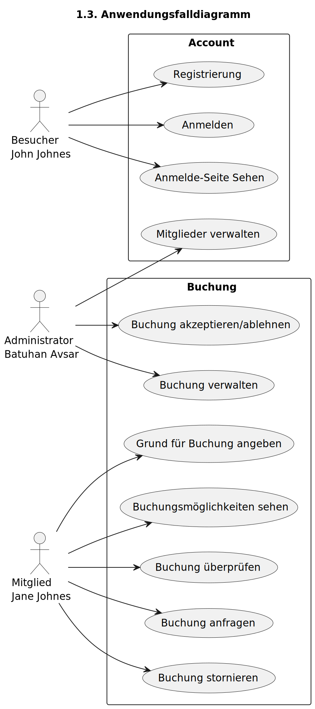
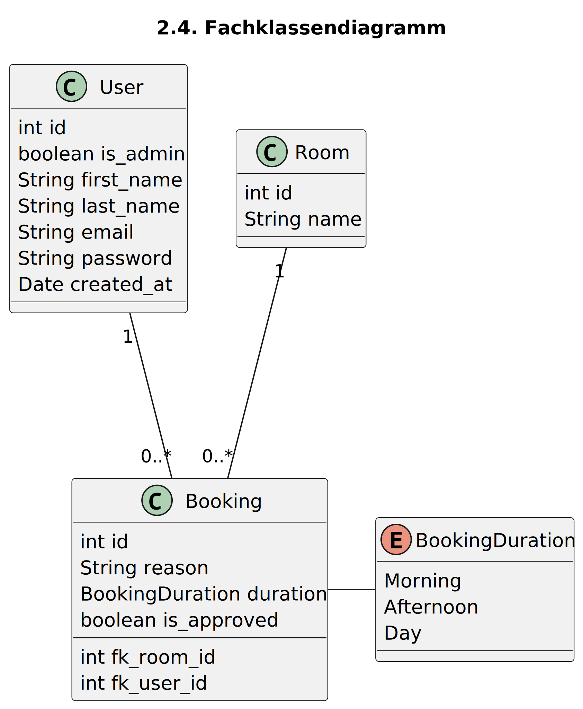
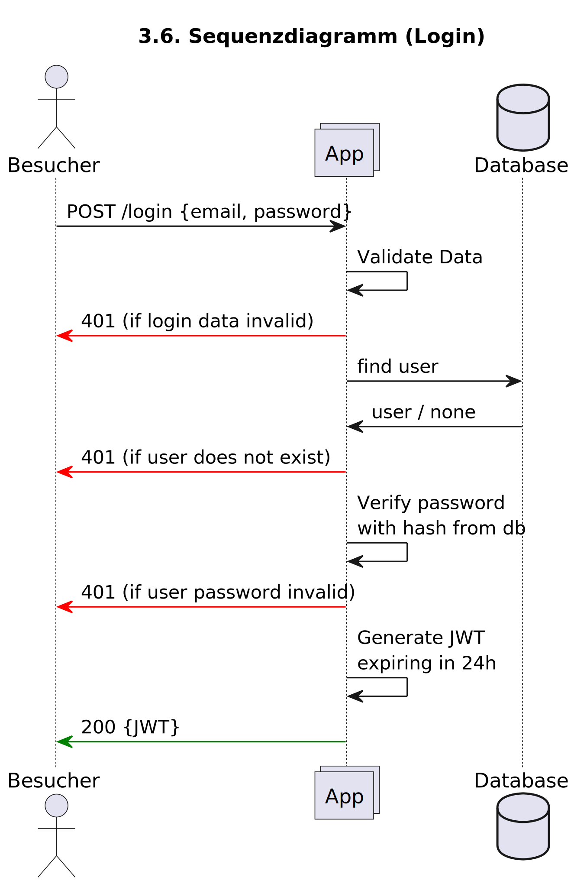

# Dokumentation M223 LB-B

von Peter Schreivogel

\pagebreak

# 1. Anforderungen analysieren

## 1.1. Erweiterte Anforderungen

### A. Drei funktionalen Anforderungen

1. Als Besucher kann ich eine Login-Seite sehen
2. Als Mitglied kann ich sehen, welche Coworking Spaces wann gebucht sind.
3. Als Mitglied kann ich einen Grund für eine Buchung angeben, sodass der
   Administrator weiss wofür ich die Coworking Space brauche.

### B. Drei nicht-funktionalen Anforderungen

1. Passwörter werden nicht in Cleartext gespeichert, sondern müssen mittels
   eines Hashing-Algorithmus wie Argon2 gehashed werden
2. Coworking Spaces können nicht doppelt gebucht werden
3. Sämtliche Requests müssen geloggt werden um Fehler und Threat Actors zu entdecken

\pagebreak

## 1.2. Persona

### P1: Besucher

| Bild                          | Name        | Alter | Geschlecht | Beruf        | Grund             |
| ----------------------------- | ----------- | ----- | ---------- | ------------ | ----------------- |
|  | John Johnes | 35    | M          | SCRUM Master | Stand-up meetings |

### P2: Mitglied

| Bild                          | Name        | Alter | Geschlecht | Beruf                 | Grund                           |
| ----------------------------- | ----------- | ----- | ---------- | --------------------- | ------------------------------- |
|  | Jane Johnes | 24    | F          | Systemadministratorin | Systemmigration planen mit Team |

### P3: Administrator

| Bild                                    | Name          | Alter | Geschlecht | Beruf                  | Grund                                         |
| --------------------------------------- | ------------- | ----- | ---------- | ---------------------- | --------------------------------------------- |
|  | Batuhan Avsar | 19    | M          | Applikationsentwickler | Neue Web-Applikation an Investoren vorstellen |

\pagebreak

# 3. Schnittstelle planen

## 3.5. Schnittstellenplanung

- Mitglied erhält nur seine eigenen Buchungen
- Administrator erhält alle Buchungen

| Methode                | Endpunkt       | Erfolgs- und Fehlerfälle                         |
| ---------------------- | -------------- | ------------------------------------------------ |
| GET (Mitglied)         | /bookings      | Erfolge: 200: Ok                                 |
|                        |                | Fehler: 401: Unauthorized                        |
| POST (Mitglied)        | /bookings      | Erfolge: 201: Created                            |
|                        |                | Fehler: 401: Unauthorized                        |
|                        |                | 409: Conflict (Raum schon gebucht)               |
|                        |                | 422: Unprocessable Entity                        |
| PATCH (Administrator)  | /bookings/{id} | Erfolge: 200: Ok                                 |
|                        |                | Fehler: 401: Unauthorized                        |
|                        |                | 404: Not Found                                   |
|                        |                | 422: Unprocessable Entity                        |
| DELETE (Mitglied)      | /bookings/{id} | Erfolge: 204: No Content                         |
|                        |                | Fehler: 401: Unauthorized                        |
| GET (Administrator)    | /users         | Erfolge: 200: Ok                                 |
|                        |                | Fehler: 401: Unauthorized                        |
| POST (Administrator)   | /users         | Erfolge: 201: Created                            |
|                        |                | Fehler: 401: Unauthorized                        |
|                        |                | 409: Conflict (Benutzer existiert schon)         |
|                        |                | 422: Unprocessable Entity                        |
| PATCH (Administrator)  | /users/{id}    | Erfolge: 200: Ok                                 |
|                        |                | Fehler: 401: Unauthorized                        |
|                        |                | 404: Not Found                                   |
|                        |                | 422: Unprocessable Entity                        |
| DELETE (Administrator) | /users/{id}    | Erfolge: 204: No Content                         |
|                        |                | Fehler: 401: Unauthorized                        |
| POST (Besucher)        | /login         | Erfolge: 200: Ok                                 |
|                        |                | Fehler: 401: Unauthorized                        |
| POST (Besucher)        | /register      | Erfolge: 200: Ok                                 |
|                        |                | Fehler: 409: Conflict (Benutzer existiert schon) |

